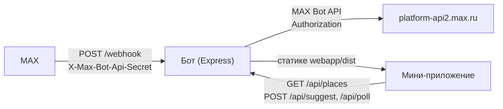

# Куда пойти компанией

Подбор мест для встреч компанией и голосование за варианты прямо в чате MAX.

   

## Оглавление

- [Назначение](#назначение)
- [Основной сценарий](#основной-сценарий)
- [Возможности](#возможности)
- [Архитектура](#архитектура)
- [Запуск одной командой (Docker)](#запуск-одной-командой-docker)
- [Переменные окружения](#переменные-окружения)
- [Порты](#порты)
- [Зависимости](#зависимости)
- [Внешние интеграции](#внешние-интеграции)
- [Работа с тестовыми данными](#работа-с-тестовыми-данными)
- [Пошаговый сценарий проверки](#пошаговый-сценарий-проверки)
- [Известные ограничения](#известные-ограничения)
- [Остановка и перезапуск](#остановка-и-перезапуск)
- [Команда](#команда)
- [Планы развития](#планы-развития)

## Назначение

Договориться, куда пойти компанией, обычно тонет в переписке. Пример: пятеро друзей два дня кидают варианты в чат, «за» и «против» теряются выше по ленте, в итоге никто не помнит, за что голосовали.

Бот присылает в чат карточки мест с кнопкой «Голосую за это место». Голоса считаются сами. Когда все проголосовали или прошло 10 минут, бот пишет победителя.

Это для компаний друзей или коллег, которые выбирают место для встречи и уже сидят в MAX.

## Основной сценарий

1. Человек открывает бота и жмёт старт. Бот здоровается и показывает кнопку «Открыть мини-приложение».
2. Команда `/help` в любой момент показывает короткую справку, что умеет бот.
3. Человек открывает мини-приложение. Сейчас там экран-заглушка: фильтры и список мест появятся позже, API под них уже готово.
4. Подборка мест запрашивается у `GET /api/places` с фильтрами: категория, число людей, метро и радиус, цена, район, «только в помещении», «открыто сейчас».
5. Выбранное место уходит в чат карточкой через `POST /api/suggest`: название, категория, цена, район, адрес, ссылка на карту, кнопка «Голосую за это место».
6. Для выбора из 2–3 вариантов создаётся опрос (`POST /api/poll`). Каждый жмёт «Голосую», повторный клик переносит голос на другое место. Текущий счёт виден через `GET /api/poll/:id`.
7. Бот пишет победителя, когда проголосовали все или прошло 10 минут.

## Возможности

- Приветствие, `/start`, `/help`, подсказка на остальные сообщения.
- Кнопка «Открыть мини-приложение» в приветствии (если задан `WEBAPP_URL`).
- Подборка мест по 9 фильтрам с сортировкой по рейтингу, цене и названию.
- Карточки мест в чат с кнопкой голосования и ссылкой на карту.
- Опросы на 2–3 места, смена голоса повторным кликом, счёт и победитель.
- Проверка подписи `X-Max-Init-Data` (включается флагом `REQUIRE_INIT_DATA`).
- Проверка секрета вебхука, защита от повторной обработки апдейтов.
- Лимиты запросов, очередь отправки в MAX, повторные попытки при 429 и 5xx.
- Понятные ошибки на русском, логи без секретов, 33 автотеста, CI.

Не реализовано: интерфейс мини-приложения (экран-заглушка), получение событий через Long Polling.

## Архитектура



| Папка / файл | За что отвечает |
| --- | --- |
| `webapp/` | Мини-приложение: Vite + React + TS, MAX UI, MAX Bridge. Сейчас экран-заглушка |
| `bot/src/index.ts` | Точка входа: логи, CORS, лимиты, маршруты, аккуратное завершение |
| `bot/src/webhook.ts` | Приём апдейтов MAX: приветствие, команды, голосование |
| `bot/src/max-api.ts` | Обёртка над MAX Bot API: таймаут 10 с, ретраи, очередь отправки |
| `bot/src/places/` | Места: датасет, фильтры, карточки, опросы в памяти, роутер `/api` |
| `bot/src/auth/` | Проверка заголовка `X-Max-Init-Data` по схеме MAX |
| `bot/src/config.ts`, `bot/src/http.ts` | Проверка env при старте, общий формат ошибок |
| `bot/Dockerfile` | Сборка в три стадии: webapp, bot, рантайм |

Направление запросов: MAX → `POST /webhook` (заголовок `X-Max-Bot-Api-Secret`), бот → MAX Bot API (заголовок `Authorization: <MAX_BOT_TOKEN>`).

## Запуск одной командой (Docker)

```bash
cp .env.example .env
# вписать MAX_BOT_TOKEN и WEBHOOK_SECRET в .env
docker compose up --build
```

Ожидаемый результат: в логах строка «бот слушает :3000», мини-приложение открывается на http://localhost:3000, `GET /health` отдаёт `{"ok": true}`.

Локальная разработка без Docker:

```bash
cd bot && npm install && npm run dev
```

```bash
cd webapp && npm install && npm run dev
```

Бот слушает http://localhost:3000, приложение — http://localhost:5173. Экран приложения работает и вне MAX (включается мок Bridge). Фронт пока не ходит в `/api`: переменная `VITE_API_URL` зарезервирована в `webapp/.env.example` на будущее.

## Переменные окружения

| Переменная | Обязательна | Описание | Пример |
| --- | --- | --- | --- |
| `MAX_BOT_TOKEN` | Да, кроме dev | Токен бота, уходит в заголовок `Authorization` | `0000000000-aaaa-bbbb` |
| `WEBHOOK_SECRET` | Рекомендуется | Секрет подписки, сверяется с `X-Max-Bot-Api-Secret`. Без него проверка выключена | `my-secret-123` |
| `PORT` | Нет (3000) | Порт сервера, он же пробрасывается наружу | `3000` |
| `MAX_API_BASE_URL` | Нет | База MAX Bot API | `https://platform-api2.max.ru` |
| `WEBAPP_URL` | Нет | Ссылка для кнопки «Открыть мини-приложение». Без неё приветствие без кнопки | `https://max.ru/my_bot?startapp=` |
| `ALLOWED_ORIGIN` | Нет | CORS для `/api`, можно списком через запятую. Без неё CORS-заголовков нет, в dev разрешён `http://localhost:5173` | `https://example.com` |
| `REQUIRE_INIT_DATA` | Нет (`false`) | `true` — требовать `X-Max-Init-Data` на `/api`, иначе 401 | `true` |
| `LOG_LEVEL` | Нет | Уровень логов (`debug` в dev, `info` в проде) | `info` |

Без `MAX_BOT_TOKEN` в проде бот не стартует. При `REQUIRE_INIT_DATA=true` без токена — тоже выход с ошибкой.

## Порты

Один порт: `3000` (или значение `PORT`). На нём и бот, и статика мини-приложения. В `docker-compose.yml` хост и контейнер маппятся один к одному: `"${PORT:-3000}:${PORT:-3000}"`.

## Зависимости

| Пакет | Зависимости | Для разработки |
| --- | --- | --- |
| `webapp` | `react` 19.2.8, `react-dom` 19.2.8, `@maxhub/max-ui` ^0.5.0 | `vite` ^8.3.0, `typescript` ~6.0.2, `@vitejs/plugin-react` ^6.1.1, `oxlint` ^1.81.0 |
| `bot` | `express` ^4.21.2, `dotenv` ^16.4.5, `zod` ^4.6.5, `pino` ^10.3.1, `pino-http` ^11.0.0, `express-rate-limit` ^8.7.0, `cors` ^2.8.6 | `tsx` ^4.19.1, `typescript` ~5.6.2, `vitest` ^5.0.2, `@types/*` |
| Рантайм | `node:22-alpine` | — |

## Внешние интеграции

- MAX Bot API — https://dev.max.ru/docs-api. База `https://platform-api2.max.ru`, токен только заголовком `Authorization`.
- MAX UI — https://dev.max.ru/ui. Пакет `@maxhub/max-ui`, приложение завёрнуто в провайдер `MaxUI`.
- MAX Bridge — https://dev.max.ru/docs/webapps/bridge. Подключается скриптом `https://st.max.ru/js/max-web-app.js`, дальше доступен `window.WebApp`.
- Вебхук MAX требует публичный HTTPS-адрес на порту 443, самоподписные сертификаты не подходят. Для локальной разработки — туннель и подписка:

```bash
curl -X POST "https://platform-api2.max.ru/subscriptions" \
  -H "Authorization: $MAX_BOT_TOKEN" -H "Content-Type: application/json" \
  -d '{"url":"https://your-domain.com/webhook","update_types":["message_created","message_callback","bot_started"],"secret":"your-secret"}'
```

## Работа с тестовыми данными

Демо-датасет — 15 мест Москвы в `bot/src/places/data.ts`. Категории: кафе, рестораны, бары, коворкинги, парки, музеи, кино, спорт, караоке, квесты. Районы: Тверской, Арбат, Басманный, Беговой, Даниловский, Пресненский, Таганский, Якиманка. У каждого места: адрес, метро с координатами, вместимость, цена 1–3, часы, рейтинг, ссылки на Яндекс Карты и 2ГИС.

Чтобы добавить своё место, допишите объект с теми же полями в массив `PLACES`. Голоса и опросы живут в памяти процесса и сбрасываются при перезапуске.

## Пошаговый сценарий проверки

1. Запустите сервер (Docker — раздел выше, или локально `cd bot && npm install && npm run dev`). В логах — «бот слушает :3000».
2. Проверка здоровья:

```bash
curl localhost:3000/health
```

```json
{"ok": true}
```

3. Подборка мест старыми параметрами:

```bash
curl "localhost:3000/api/places?categories=cafe&people=8"
```

Ожидаемый результат: массив из одного места, `id` — `veranda-cafe`.

4. Новые фильтры:

```bash
curl "localhost:3000/api/places?priceMax=1&sort=rating"
```

Ожидаемый результат: только места с `priceLevel` 1, первым — с наивысшим `rating`.

5. Неверный параметр:

```bash
curl "localhost:3000/api/places?sort=nope"
```

Ожидаемый результат: `400` и `{"ok":false,"error":"неверный запрос: sort — надо одно из: rating, price, name"}`.

6. Карточка без `chatId`:

```bash
curl -X POST localhost:3000/api/suggest \
  -H "Content-Type: application/json" \
  -d '{"placeId":"zerno-cafe"}'
```

Ожидаемый результат: `400`, в `error` — про `chatId`.

7. Карточка с неизвестным местом:

```bash
curl -X POST localhost:3000/api/suggest \
  -H "Content-Type: application/json" \
  -d '{"placeId":"nope","chatId":123}'
```

Ожидаемый результат: `404`, `{"ok":false,"error":"такое место не найдено"}`.

8. Карточка без токена бота:

```bash
curl -X POST localhost:3000/api/suggest \
  -H "Content-Type: application/json" \
  -d '{"placeId":"zerno-cafe","chatId":123}'
```

Ожидаемый результат: `502`, `{"ok":false,"error":"не вышло отправить в чат, попробуйте позже"}`. С токеном и настоящим `chatId` карточка уходит в чат, ответ — `{"ok":true,"pollId":"..."}`.

9. Вебхук с пустым телом:

```bash
curl -X POST localhost:3000/webhook \
  -H "Content-Type: application/json" \
  -d '{}'
```

Ожидаемый результат: `400`, `{"ok":false,"error":"непонятный апдейт от MAX"}`. Если в `.env` задан `WEBHOOK_SECRET`, запрос без заголовка `X-Max-Bot-Api-Secret` даёт `403`.

10. Несуществующий опрос:

```bash
curl localhost:3000/api/poll/xxx
```

Ожидаемый результат: `404`, `{"ok":false,"error":"такого опроса нет"}`. Полный цикл опроса (создание, кнопки, победитель) требует токен и настоящий чат, см. [Основной сценарий](#основной-сценарий).

11. Тесты бота:

```bash
cd bot && npm test
```

Ожидаемый результат: 4 файла, 33 теста, все зелёные.

## Известные ограничения

- Вебхук принимает только HTTPS на порту 443 с доверенным сертификатом. Так требует MAX.
- В MAX уходит не больше 2 сообщений в секунду на один чат, остальное ждёт в очереди.
- Голоса и опросы хранятся в памяти. Перезапуск всё сбрасывает.
- Проверка `X-Max-Init-Data` выключена по умолчанию. Включается флагом, когда приложение начнёт слать заголовок.
- Экран мини-приложения — заглушка. Фильтры и кнопка «Предложить в чат» в интерфейсе ещё не сверстаны.
- Опросы без `expectedVoters` закрываются только по таймеру через 10 минут.

## Остановка и перезапуск

```bash
docker compose down
```

```bash
docker compose up --build
```

```bash
docker compose logs -f bot
```

Остановить, перезапустить с пересборкой, посмотреть логи. Локально сервер останавливается через Ctrl+C — соединения закрываются сами.

## Команда

| Имя | Роль | Контакт |
| --- | --- | --- |
| `TODO(имя)` | `TODO(роль)` | `TODO(контакт)` |
| `TODO(имя)` | `TODO(роль)` | `TODO(контакт)` |
| `TODO(имя)` | `TODO(роль)` | `TODO(контакт)` |

## Планы развития

- Сверстать экран мини-приложения: фильтры, список мест, кнопка «Предложить в чат».
- Заменить датасет в коде на базу данных с импортом мест.
- Включить проверку `X-Max-Init-Data` по умолчанию, когда приложение начнёт слать заголовок.
- Обновлять сообщение опроса живым счётом при каждом голосе.
- Добавить создание опроса кнопкой из мини-приложения, а не только через API.
